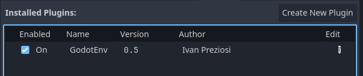

# Godot-Env
 

Godot-Env provides a minimal and robust implementation of the  <a href="https://12factor.net/config" target="_blank">.env pattern</a> for Godot Engine. It is designed to be extremely lightweight and dependency-free, offering a clean way to manage your application's configuration by separating it from the source code.

## Installation
The package is a plugin for Godot 4.4 and can be installed by downloading the plugin and putting it in your addons folder:

    res://addons/

The installed folder structure should be like this:

    📁 res:// 
    ├── 🗂️ addons/ 
    │	└──🗂️ godot-env/
    │ 	   └── 📄 LICENCE.txt 
    │ 	   └── 📄 README.md
    │ 	   └── 🖼️ plugins.png
    │ 	   └── 🖼️ logo.png
    │ 	   └── 🗂️ GodotEnv/ 
    │	       	├── 📄 EnvManager.gd 
    │	       	├── 📄 env_example.env 
    │	       	├── 📄 GodotEnv.gd 
    │               ├── 📄 plugin.cfg
    │               └── 🗂️ test_scene/ *(this is not required for production)*
    │ 	    	   ├──── 📄 EnvTestScene.tscn 
    │		   └──── 📄 env_test_scene.gd
    │       	   └──── 📄 test_env_manager.gd (a minimal unit test file)

 ## Enable the plugin in godot
After importing the scripts (test_scene is not needed for plugin functioning), you will need to activate it in your Godot project:

 

You will find the plugins panel under the menu: Project -> Project Settings -> Plugins

## The Env file
The env file is quite auto explanatory.

    ## Example env file #####################
    SERVER_NAME=My Server Name # value can contain spaces and a trailing comment
    IS_PROTECTED=true # bool values are supported
    PORT=60666 # integer are supported
    MODIFIER=1.5 # floats are supported
    STRING_NUMBER="2.5" # quotation marks convert all values to string
    
    # you can use the "=" char in your values. NAMES THOUGH CAN NEVER USE THE "=" CHAR! 
    SALT=aaabbbccc=cccbbbaaa 
    
    DATA_PATH="res://data" # this will return as a string
    DATA FILE=pathfile # names support also spaces, i don't like it toh
    #########################################

 - Your key names must never ever contain the "equal" char "=" or everything will break.
 - Key Names can contain spaces and other chars, but using only **CONSTANT_CASE** is strongly suggested!
 - String, Int, Float and Bool values are accepted and managed
 - Line comments and trailing comments are supported
 - Quotation marks enclosed values are supported and converted to String by default
## Env File Placement Strategy
When working with environment variables (.env files) in Godot, strategic placement is crucial to ensure they serve their purpose as installation-specific configuration values and are not accidentally bundled with your exported game builds.

#### Why Not Pack the .env File?
Environment variables are designed to be unique to the current installation or deployment environment. This means they might contain:

- API keys or sensitive credentials: These should never be hardcoded or distributed with your application.
- Database connection strings: Specific to the server and credentials of a particular setup.
- Feature flags: Toggled based on a specific deployment (e.g., development, testing, production).
- Paths to external resources: Local paths that vary from one machine to another.
- Applications specific config values and game settings
Including the .env file directly in your packed build would defeat this purpose, potentially exposing sensitive information or forcing you to rebuild your game for every configuration change.

#### Crucial Step: Filtering from Build Settings
It is absolutely critical to exclude your .env file from Godot's export settings. Failing to do so will result in the .env file being packed inside your .pck file or executable, undermining the purpose of external configuration.

#### How to Exclude Files in Godot:
- Go to Project -> Export...
- Select your desired Export Preset (e.g., Windows Desktop, Linux/X11).
- In the "Resources" section, look for "Exclude Files" or "Filters".
- Add the path to your .env file using the res:// prefix. For example:
- If your file is res://.env, add res://.env.
- If your file is res://data/.env, add res://data/.env.
- You can also use wildcards if you have multiple .env files or other config files you want to exclude from a specific folder (e.g., res://data/* if you want to exclude everything in the data folder).

### Always Exclude .env Files from Your Git Repository
You should never commit your .env files to your Git repository. These files typically contain sensitive data, such as API keys, database credentials, or other private configuration details, which must remain confidential.

Instead, you should:

- Provide an example.env file: This file should include all the necessary keys from your .env file but with placeholder values and clear instructions on how users can configure them for their own installation.
- Offer alternative documentation: For more complex setups, provide comprehensive documentation (e.g., in your project's README.md or a dedicated wiki) guiding users through the necessary environment variable configuration steps.. 

## Usage
Once the plugin is active DotEnv should be autoloaded as a global singleton in godot.
Usage requires an actual .env file to be loaded. This is usually done at bootstrap time of your app, as one of the earliest subsystems to be loaded.
This only requires a line of code:

    extends Node
    
    func _ready() -> void:
    	DotEnv.load_env("res://addons/GodotEnv/env_example.env")
You can pass a custom path for your env file or just use the default value with the env sitting in the same folder as the root or executable.

After loading you should have the following line in your console:

    Env file loaded: res://addons/GodotEnv/env_example.env

### Values retrieval
Once the env file is loaded it will be available globally in your project. It will expose several retrieval functions to get values and infos from your env.

    extends Node
    
    func _ready() -> void:
	    # load the env file
    	DotEnv.load_env("res://addons/GodotEnv/env_example.env")
    	
    	# print an env dump to console
    	print(DotEnv.dump_as_string())
    	
    	# example of getters usage to retrieve values
    	var data = {
    		"SERVER_NAME" : DotEnv.get_string("SERVER_NAME", "bogus: SERVER_NAME"),
    		"IS_PROTECTED" : DotEnv.get_bool("IS_PROTECTED", false),
    		"PORT" : DotEnv.get_int("PORT", -1),
    		"MODIFIER" : DotEnv.get_float("MODIFIER", 5.5),
    		"STRING_NUMBER" : DotEnv.get_var("STRING_NUMBER", "nullus"),
    		"SALT" : DotEnv.get_string("SALT", "nullus salis est"),
    		"DATA_PATH" : DotEnv.get_string("DATA_PATH", "nulla via est"),
    		"DATA FILE" : DotEnv.get_string("DATA FILE", "nullum documentum est"),
    	}
    	
    	# example of has_var() usage
    	print (DotEnv.has_var("PORT"))
    	print (DotEnv.has_var("NON_EXISTENT_KEY"))
    	
    	# print the value retrieved before
    	var print_string  = '''
    	"SERVER_NAME" : {SERVER_NAME},
    	"IS_PROTECTED" : {IS_PROTECTED},
    	"PORT" : {PORT},
    	"MODIFIER" : {MODIFIER},
    	"STRING_NUMBER" : {STRING_NUMBER},
    	"SALT" : {SALT},
    	"DATA_PATH" : {DATA_PATH},
    	"DATA FILE" : {DATA FILE},
    	'''
    	print(print_string.format(data))
More informations about available methods and class details here:

https://github.com/ivanpreziosi/godot-env/blob/main/GodotEnv/docs/EnvManager.md
